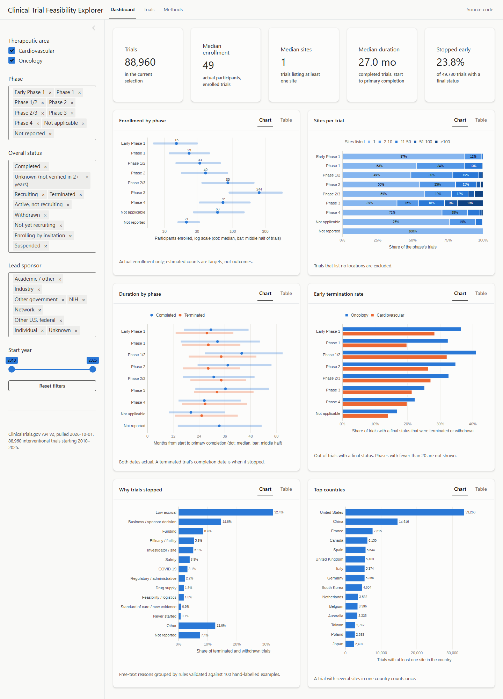
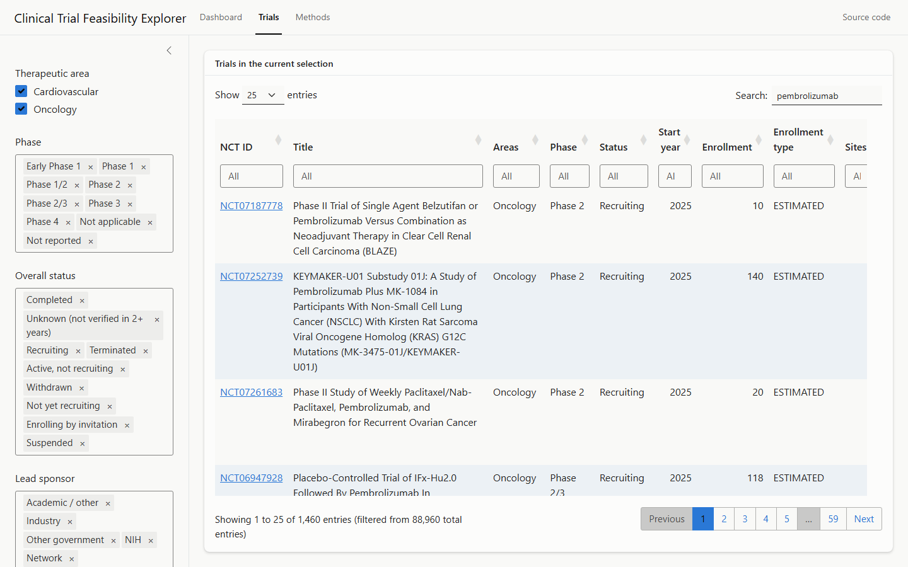
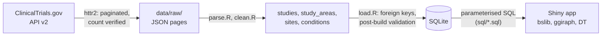
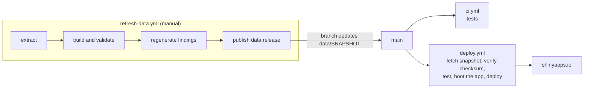

# Clinical Trial Feasibility Explorer

[](https://github.com/kartsen03/trial-feasibility-explorer/actions/workflows/ci.yml)
[](https://github.com/kartsen03/trial-feasibility-explorer/actions/workflows/deploy.yml)

An interactive R Shiny dashboard over ClinicalTrials.gov that answers the questions a
feasibility team asks when designing a study. How many participants do comparable
trials enroll? How many sites do they use? How long do they take? How often, and why,
do they stop early? Everything can be broken down by phase, therapeutic area, status,
sponsor type and start year.

**[Open the live dashboard](https://karthik-sengupta.shinyapps.io/trial-feasibility-explorer/)**
· [Methods and definitions](methods.md) · [Data releases](https://github.com/kartsen03/trial-feasibility-explorer/releases)

<!-- snapshot:start (generated by scripts/03_findings.R) -->
**Snapshot [`data-2026-10-01`](https://github.com/kartsen03/trial-feasibility-explorer/releases/tag/data-2026-10-01):** 88,960 interventional trials starting 2010 to 2025, pulled from ClinicalTrials.gov on 2026-10-01: 59,240 oncology and 32,484 cardiovascular, 2,764 of them in both.
<!-- snapshot:end -->



## Key findings

Generated by [`scripts/03_findings.R`](scripts/03_findings.R) from the dashboard's own
SQL, with the filters listed for each, so every number can be reproduced in the app.
The script checks each claim before writing it and fails if a new snapshot makes one
false.

<!-- findings:start (generated by scripts/03_findings.R; edit the script, not this block) -->

1. **Low accrual is the most common reason trials stop early.** It accounts for 32.4% of the 11,855 trials that were terminated or withdrawn (3,842 trials), and it leads in both therapeutic areas. On the hand-labelled validation sample the categoriser identifies low accrual with 95% precision and 95% recall. *Filters: none.*
2. **Oncology trials stop early more often than cardiovascular trials:** 25.9% against 17.7% of trials that started 2010 to 2019 and reached a final status (23,340 and 13,882 trials). Leaving out later start years removes a known bias: a recent trial can only be finished if it stopped early. *Filters: one area at a time; start year 2010 to 2019.*
3. **Industry-sponsored Phase 3 trials run on many more sites and finish sooner.** Their median is 48 sites against 1 for academic and hospital sponsors, and their completed trials took a median of 32.5 months from start to primary completion against 42.3 months (3,153 and 3,746 Phase 3 trials). *Filters: Phase 3; lead sponsor Industry, then Academic / other.*

<!-- findings:end -->

## What's in the dashboard

- **KPI cards:** trials in the selection, median actual enrollment, median sites, median
  duration of completed trials, and the share of finished trials that stopped early.
- **Six charts**, each with a table view, so no value is reachable only by hovering:
  enrollment by phase, sites per trial, duration (completed against terminated), early
  termination rate by area, why trials stopped, and the top countries by trial count.
- **A searchable listing** of every trial in the selection, searched on the server,
  with links to the ClinicalTrials.gov record.
- **Filters** for therapeutic area, phase, overall status, lead sponsor type and start
  year. Every chart and number responds to them.



## Architecture



The pipeline and the app meet only at the database. `pipeline/` writes it and the app
in `app.R` and `R/` only reads it, through the SQL files in `sql/`.

### Delivery



| Workflow | Runs on | What it does |
|---|---|---|
| [`ci.yml`](.github/workflows/ci.yml) | every push and pull request | Installs the dependencies in `DESCRIPTION` and runs the test suite; uploads JUnit results |
| [`deploy.yml`](.github/workflows/deploy.yml) | pushes to `main` that change the app or `data/SNAPSHOT` | Downloads the pinned snapshot, checks its SHA-256, runs the tests, starts the app and checks it serves the dashboard, then deploys |
| [`refresh-data.yml`](.github/workflows/refresh-data.yml) | manual | Runs the whole pipeline against the live API, publishes a new data release, and pushes a branch pointing the app at it, so new data is reviewed before it ships |

The 127 MB database isn't in git. Each snapshot is a GitHub release (`data-YYYY-MM-DD`)
with the compressed database, its checksum and the extraction manifests.
`data/SNAPSHOT` names the one the app runs on.

## How the data is handled

The full definitions are in [methods.md](methods.md), which the app also shows. The
decisions that matter most:

- **Therapeutic area comes from the MeSH hierarchy, not keyword matching.** A trial is
  oncology when any condition maps to *Neoplasms* (MeSH C04) or a descendant. The match
  is on the condition's own term *or* its ancestors; ancestors alone silently drop the
  6,896 oncology studies whose term is *Neoplasms* itself. A trial can be in both areas,
  so area membership is its own table and headline counts never double-count.
- **An extract is cached only once it's provably complete.** Each area is pulled into a
  staging directory and kept only if the number of studies received equals the total the
  API reported. After the build, each area's stored count is checked against that total
  again, along with referential integrity.
- **Plans are kept apart from outcomes.** Enrollment statistics use only *actual*
  counts, because an *estimated* count is the sponsor's target. Durations need both dates
  to be actual. The early-termination denominator is trials with a final status, which
  leaves out ongoing trials and the 18% whose status the sponsor hasn't verified in two
  years.
- **Messy fields are interpreted by small, tested rules.** Month-only dates are imputed
  to the 15th and flagged, and multi-phase trials (`PHASE1|PHASE2`) are a category of
  their own. Free-text stop reasons are grouped by ordered rules, and sponsor disclaimers
  such as *"no safety concerns contributed to this decision"* are stripped first, without
  which Safety is overstated by 61%. Scored blind against 100 hand-labelled reasons, the
  rules agreed on 84.
- **Site contact details are never requested** from the API, so no names, emails or phone
  numbers are stored.

## Run it locally

You need R 4.4 or newer and the packages listed in [`DESCRIPTION`](DESCRIPTION).

```bash
Rscript -e 'install.packages(c("bslib", "DBI", "DT", "ggiraph", "ggplot2", "htmltools", "httr2", "jsonlite", "openssl", "RSQLite", "scales", "shiny", "testthat"))'
```

Get the database, either by downloading the published snapshot (checksum verified):

```bash
Rscript scripts/00_download_snapshot.R
```

or by rebuilding it from the API, which takes a few minutes:

```bash
Rscript scripts/01_extract.R && Rscript scripts/02_build_db.R
```

Then start the app:

```bash
Rscript -e 'shiny::runApp()'
```

## Tests

```bash
Rscript -e 'testthat::test_dir("tests/testthat")'
```

The suite runs on hand-written fixtures and synthetic data. It needs no network
access or built database. Among other things it checks:

- every messy-data rule: absent fields, multi-phase arrays, partial and impossible
  dates, a study repeated across pages, and a trial in both areas;
- that the SQL medians and quartiles, written with window functions because SQLite has
  no `MEDIAN`, equal R's `median()` and `quantile(type = 1)` on random data;
- that the headline numbers match hand counts, and that empty selections return zeros
  rather than errors;
- that a filter value such as `'); DROP TABLE studies; --` is bound as data;
- that the stop-reason rules still agree with the hand-labelled validation sample;
- that stacked and dodged charts keep segment, label and legend order. ggplot
  otherwise groups by the tooltip strings, which once put every site-count label on the
  wrong segment.

## Repository layout

```text
app.R                   Shiny UI and server
R/                      queries.R (runs sql/), plots.R (charts and table views), labels.R
sql/                    schema, filter, and one file per dashboard query
pipeline/               extract.R, parse.R, clean.R, load.R
scripts/                00 download snapshot, 01 extract, 02 build, 03 findings, deploy
tests/testthat/         tests and fixtures, including the hand-labelled stop reasons
methods.md              definitions and caveats, also shown in the app
data/SNAPSHOT           the data release the app runs on
```

## Data and license

Trial data comes from [ClinicalTrials.gov](https://clinicaltrials.gov), a service of
the U.S. National Library of Medicine. Inclusion in this dashboard implies no
endorsement by NLM. The code is released under the [MIT license](LICENSE).
